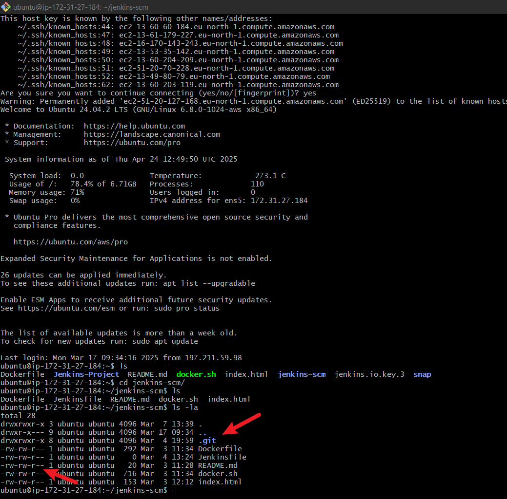
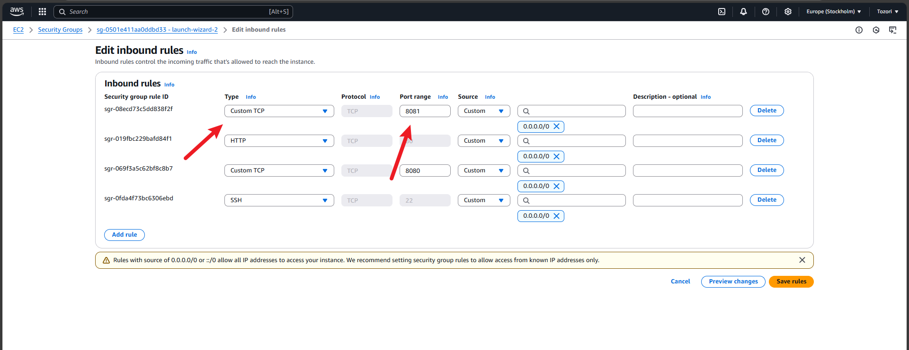

## JENKINS PIPELINE 

#  Project Objective

1. Automating a jenkins job

Steps;
1. Creating a pipeline job on jenkins

2. Configuring triggers for jenkins to trigger new build.

3. Jenkins Pipeline Scripts 

4. Connect jenkins to Github repository using pipeline syntax

5. Installing Docker

granting permission right to file docker.sh to execute

`chmod u+x docker.sh`

6. Docker is running

7. Build pipeline script

8. bIndex.html file created 

9. Pushing Dockerfile and index.html to the Repository

10. Job done

11. Defined inbound rules to allow port 8081 to access index.html

12. Successful complete

